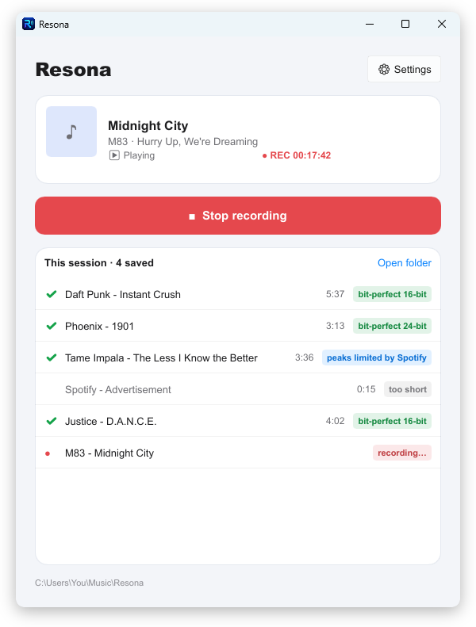
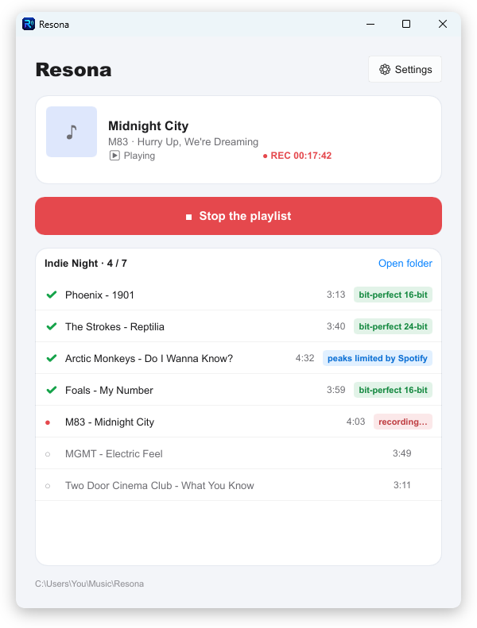
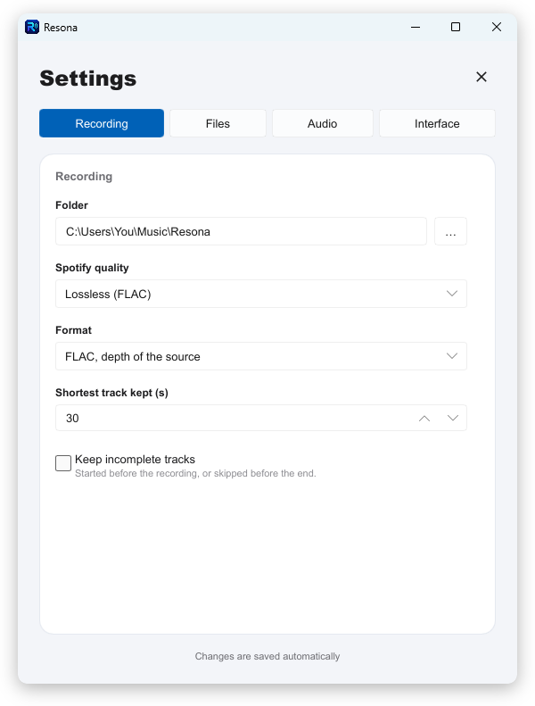
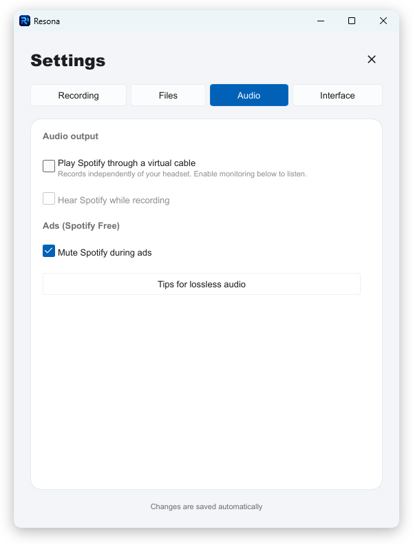

<!-- markdownlint-disable MD033 MD041 -->
<p align="center">
  
</p>

<h1 align="center">Resona</h1>

<p align="center">
  <strong>Record Spotify on Windows, one tagged file per track — and see which ones came out bit-perfect.</strong>
</p>

<p align="center">
  <a href="https://github.com/InstaZDLL/resona/actions/workflows/ci.yml"></a>
  <a href="https://github.com/InstaZDLL/resona/actions/workflows/codeql.yml"></a>
  
  
  
  
  
  
</p>

<p align="center">
  Resona listens to the Spotify desktop app — and only to it — cuts the stream at every
  track change and saves each song as FLAC, WAV or MP3 with its album, cover, track number and
  lyrics. With Spotify Premium in <b>Lossless</b>, it checks every single sample and tells you
  whether the file is an exact copy of what Spotify decoded.
</p>

<p align="center">
  <a href="#install"><b>Install</b></a>
  &nbsp;·&nbsp;
  <a href="#features"><b>Features</b></a>
  &nbsp;·&nbsp;
  <a href="#screenshots"><b>Screenshots</b></a>
  &nbsp;·&nbsp;
  <a href="#get-lossless-recordings"><b>Lossless set-up</b></a>
  &nbsp;·&nbsp;
  <a href="#faq"><b>FAQ</b></a>
  &nbsp;·&nbsp;
  <a href="#build-from-source"><b>Build</b></a>
</p>

<p align="center">
  
</p>

---

## Why Resona

|  |  |
| --- | --- |
| 🎯 **Proven lossless** | Not "probably lossless": every sample is checked against the 16- and 24-bit grids. A track is labelled *bit-perfect* only if it is the exact integer stream Spotify decoded, give or take the few hundred samples Spotify itself softens around a pause (at most 1 in 10,000); anything else gets its own badge. |
| 🔇 **Only Spotify's sound** | Per-process capture: notifications, videos and other apps never end up in your files. |
| 📋 **Paste a playlist, walk away** | Private playlists and albums included. Resona starts them in Spotify, records every track and pauses Spotify at the end. |
| 🏷️ **Files you don't have to fix** | Album, track number, date, copyright, 640 px cover of the release actually played, and synced lyrics in a `.lrc`. |

## Features

### 🎙️ Recording

- **Spotify's audio only** — WASAPI per-process loopback on the Spotify process tree.
- **One file per track**, cut on the silence between songs, with the leading and trailing silence trimmed.
- **FLAC, WAV or MP3** — FLAC and WAV keep the depth of the source (16 or 24-bit), MP3 from 128 to 320 kbps.
- **A quality badge on every track** — *bit-perfect 16/24-bit*, *peaks limited by Spotify*, *slightly changed by Spotify* or *altered*, from an analysis of every sample.
- **Incomplete tracks** (joined late, skipped) and very short ones are left out, unless you want them.
- **Ads** (Spotify Free) are never recorded and can be muted.

### 📋 Playlist mode

- **Paste a link** to a playlist (private ones too), an album or a track.
- Resona turns shuffle and repeat off, sets Spotify's volume to 100 %, plays the list from the start and **pauses Spotify when it is over** — no autoplay track sneaks in.
- Progress at a glance (`Indie Night · 4 / 7`), and a **Retry the missed** button that plays the tracks that did not make it, one by one.
- Driven through `spotify_cli`, the command-line tool Spotify itself ships: nothing is injected into Spotify.

### 🏷️ Tags, covers and lyrics

- **Spotify's catalogue first**: the exact release that played (single, album or compilation), its album artists, track number, release date, copyright and a 640 × 640 cover.
- **Deezer** completes genre, ISRC and label.
- **Synced lyrics** from [LRCLIB](https://lrclib.net) written next to each track as `Artist - Title.lrc` (plain lyrics when no timing exists), read by foobar2000, MusicBee, Poweramp, Plexamp…
- Folders by artist or artist / album, track or recording-order numbers, and tracks you already have are skipped — or replaced, or kept twice.

### 🎚️ A clean signal, checked for you

- **Before recording**, Resona warns about anything that would alter the sound: Spotify's volume below 100 % (one click sets it back), normalization, Automix, a quality other than Lossless, Windows audio enhancements, an output device not at 44.1 kHz.
- **Virtual cable mode** (optional, [VB-Cable](https://vb-audio.com/Cable/)): Spotify plays silently into the cable, which Resona sets up by itself. Your headset's settings stop mattering, you can listen to something else — or have Resona play the recording back to you.
- If Spotify adds a crossfade at a track change, Resona notices and tells you how to turn it off.

### ✨ And also

- **English and French** interface.
- **Keeps recording in the background**: close the window, Resona stays in the notification area.
- **Update check** against GitHub releases.
- **Per-user installer**, no administrator rights.

## Screenshots

<table>
  <tr>
    <td width="50%"></td>
    <td width="50%"></td>
  </tr>
  <tr>
    <td align="center"><sub><b>Playlist mode</b> · progress, and the tracks still waiting</sub></td>
    <td align="center"><sub><b>Session</b> · a quality badge on every track</sub></td>
  </tr>
  <tr>
    <td width="50%"></td>
    <td width="50%"></td>
  </tr>
  <tr>
    <td align="center"><sub><b>Settings</b> · format, quality, folder</sub></td>
    <td align="center"><sub><b>Audio</b> · virtual cable and ads</sub></td>
  </tr>
</table>

## Install

1. Download **`resona_<version>_x64-setup.exe`** from the [latest release](https://github.com/InstaZDLL/resona/releases/latest).
2. Run it. It installs for your user only — no administrator rights needed.

> [!NOTE]
> The installer and `resona.exe` are signed, but with a self-signed certificate that Windows does not recognise as a publisher yet. On first launch SmartScreen may say *"Windows protected your PC"*: click **More info**, then **Run anyway**.

**Requirements**

- **Windows 11.** The per-process capture needs Windows build 20348 or later; Windows 10 is not supported.
- **The Spotify desktop app**, logged in. The Microsoft Store version ships `spotify_cli`, which powers playlist mode, exact tags and the volume check; without it, recording still works.

## Your first recording

1. Open Spotify, then Resona.
2. Either press **Start recording** and play anything in Spotify, or paste a playlist / album link and press **Record it**.
3. Watch the badges: green means bit-perfect. Your files land in `Music\Resona` (change it in **Settings → Recording**).

## Get lossless recordings

Resona tells you when something is off, but here is the whole checklist:

| Where | Setting |
| --- | --- |
| Spotify | **Premium**, Audio quality → **Lossless** |
| Spotify | **Volume at maximum** (Resona can set it) |
| Spotify | Normalize volume, Equalizer, **Crossfade** and **Automix**: **off** |
| Windows | Audio enhancements **off** for the output device |
| Windows | Output device format at **44,100 Hz** |

Or turn on **Settings → Audio → Play Spotify through a virtual cable**: the two Windows lines then no longer apply.

> [!TIP]
> Some tracks are limited or processed by Spotify itself; Resona labels them *peaks limited by Spotify* or *slightly changed by Spotify*. Nothing on your side can make those bit-perfect.

## FAQ

<details>
<summary><b>Does it record faster than real time?</b></summary>

No. Resona records what Spotify plays, so a one-hour playlist takes one hour. Faster tools get there by intercepting Spotify's DRM; Resona does not touch it. With the virtual cable you can listen to something else in the meantime.
</details>

<details>
<summary><b>Why does a track say "peaks limited by Spotify"?</b></summary>

Spotify applies a limiter to some loud masters. The quiet parts are exact, the loudest peaks were changed by Spotify before the sound reached Windows. The file keeps exactly what Spotify played, at 24-bit.
</details>

<details>
<summary><b>Every track says "altered". What did I miss?</b></summary>

Look at the warnings at the top of the window: usually Spotify's volume below 100 %, normalization, a Windows audio enhancement, or the output device at 48 kHz. The virtual cable mode avoids the Windows side altogether.
</details>

<details>
<summary><b>Is this legal?</b></summary>

Resona records the audio output, like any recorder plugged into the speakers, and does not circumvent Spotify's DRM. Recording may still be against Spotify's terms of use and your local law: keep the files for your own use.
</details>

## Build from source

You need Windows, Rust (the toolchain is pinned in `rust-toolchain.toml`) and the MSVC build tools.

```powershell
cargo run -p resona                                                    # run the app
cargo test --workspace                                                 # tests
cargo clippy --workspace --all-targets -- -D warnings                  # lint
cargo packager --release -p resona                                     # installer (cargo install cargo-packager)
cargo run -p resona-core --example capture_spotify -- 30 capture.flac  # capture + fidelity diagnostics
```

`RESONA_DEMO=session` (or `playlist`, `settings-0` … `settings-3`) fills the window with sample content for screenshots.

| Crate | What it holds |
| --- | --- |
| [`crates/core`](crates/core) | The engine, no UI: Spotify detection, per-process capture, bit-perfect analysis, track splitting, FLAC / WAV / MP3 encoding, tags, lyrics, playlist sessions |
| [`crates/app`](crates/app) | The Slint interface, settings, notification area icon |

Design notes and every measurement behind the choices are in [`docs/PLAN.md`](docs/PLAN.md) (in French).

## Credits

- A Rust rewrite of [Spytify](https://github.com/jwallet/spy-spotify) by jwallet.
- Lyrics from [LRCLIB](https://lrclib.net), extra tags from [Deezer](https://developers.deezer.com/api).
- Interface by [Slint](https://slint.dev), audio through [wasapi-rs](https://github.com/HEnquist/wasapi-rs), FLAC by [flacenc](https://github.com/yotarok/flacenc-rs), tags by [lofty](https://github.com/Serial-ATA/lofty-rs).
- Resona is not affiliated with, endorsed or sponsored by Spotify.

## License

[MIT](LICENSE) © 2026 InstaZDLL
